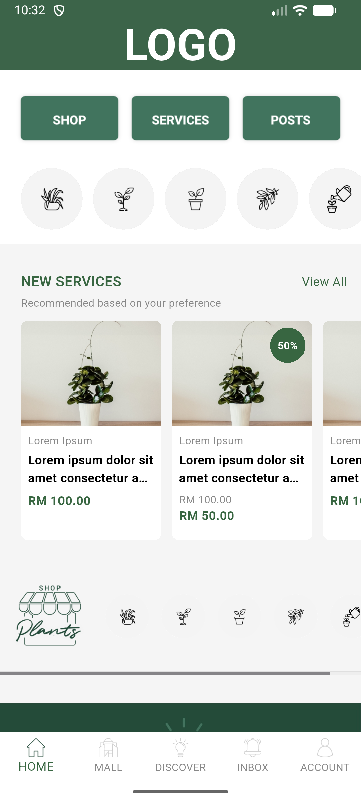
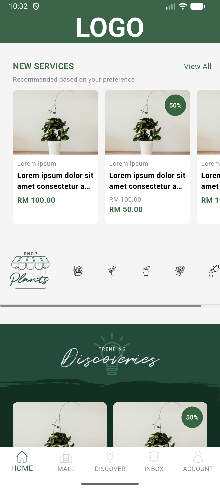
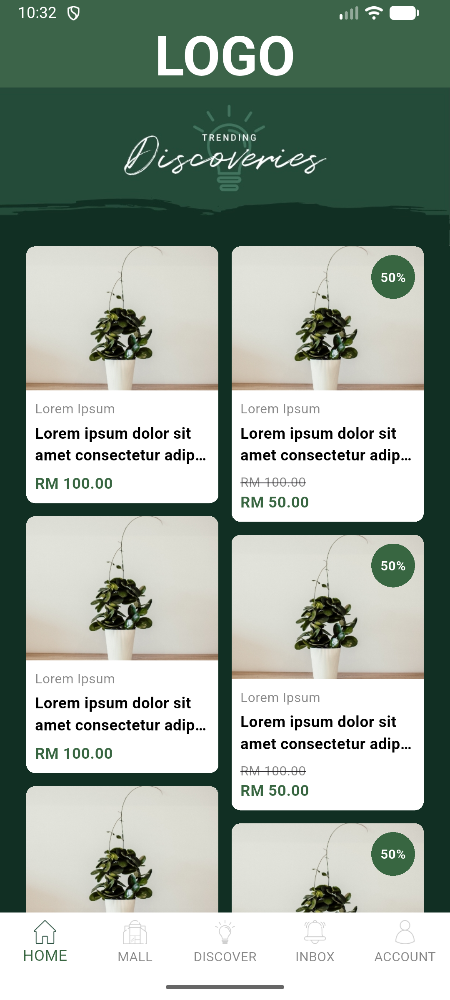
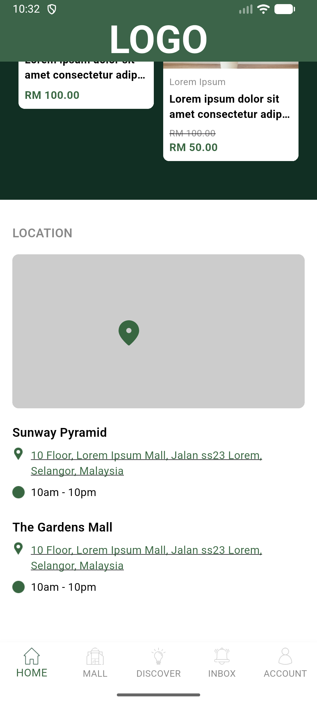
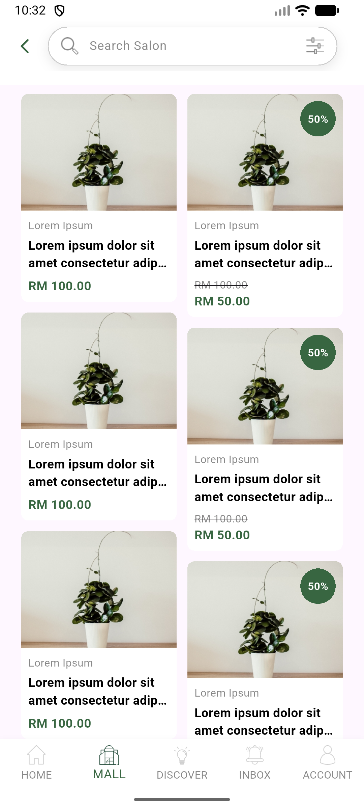
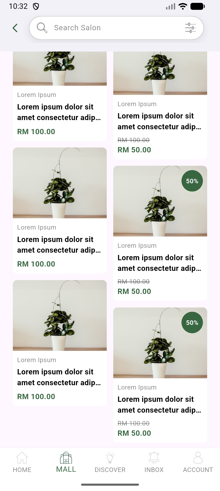

# 📱 Mall Mobile App  
A clean Flutter mobile application with modular architecture (BLoC + Clean Code).

---

## 📸 Screenshots

Berikut tampilan aplikasi berdasarkan file yang ada di folder **app_screenshoot**:

<p align="center">
  
  
  
</p>

<p align="center">
  
  
  
</p>


---

## 🏗️ Features

- Home Mall UI  
- Masonry Grid Product Listing  
- Category Carousel with Overlay Logo  
- Custom Bottom Navigation  
- Clean Architecture (Presentation → Domain → Data)  
- Flutter BLoC for state management  
- Reusable components: ProductCard, Buttons, IconCircleButton, Navbar, dll.

---

## 🧱 Tech Stack

- **Flutter**
- **Dart**
- **flutter_bloc**
- **flutter_staggered_grid_view**
- **Clean Architecture Layering**

---

## 📂 Project Structure (Short Version)

```bash
lib/
  core/
  common/
  features/
    home/
    mall/
    discover/
    inbox/
    account/
